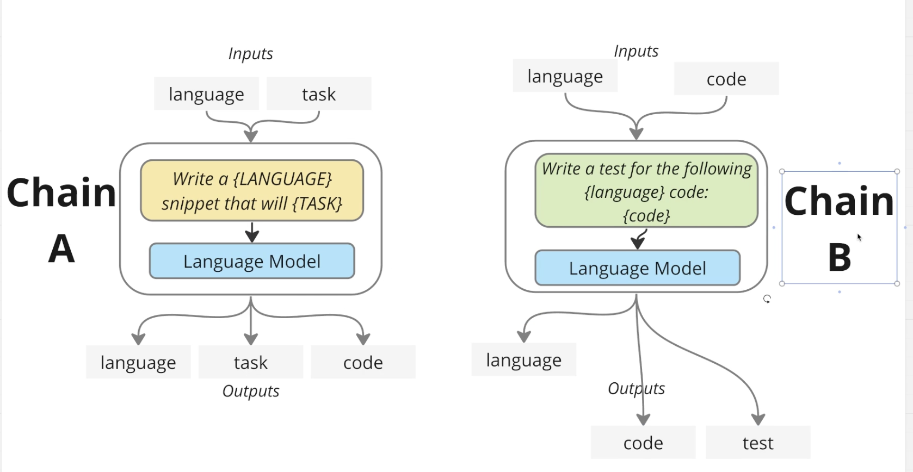

# Simple chain
Simple program in Python to run multiple chains sequentially.

## Flow


## Usage
```shell
python main.py --language python --task "return the sum of two numbers"
```

## Output
```shell
function 

def add(x, y):
  return x + y
test 


import unittest

def add(x, y):
  return x + y

class TestAdd(unittest.TestCase):
  
  def test_add(self):
    self.assertEqual(add(2,3), 5)
    self.assertEqual(add(-5,10), 5)
    self.assertEqual(add(0,100), 100)
    self.assertEqual(add(-10,-5), -15)

if __name__ == '__main__':
  unittest.main()
```